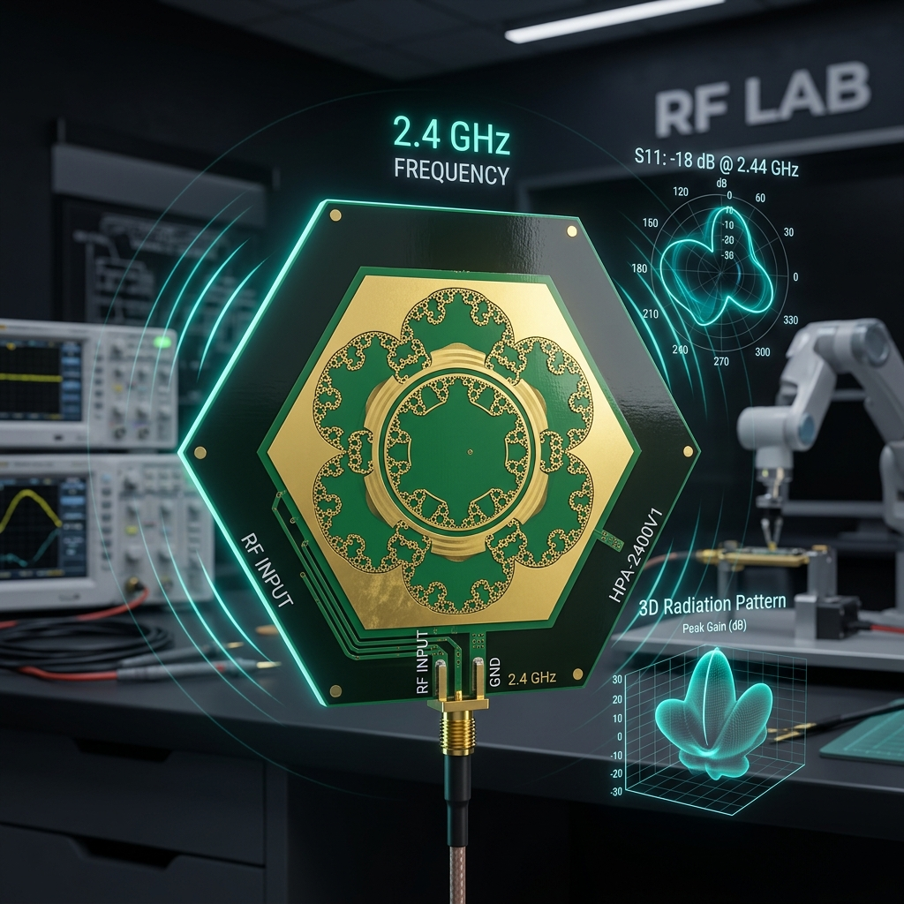
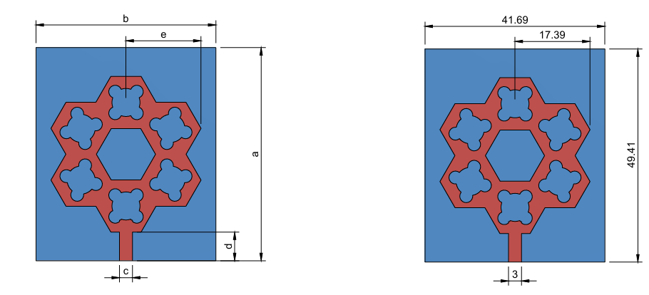

# Compact Hexagonal Fractal Patch Antenna for 2.4 GHz Wireless Communication Applications



An engineering project showcasing the design, simulation, fabrication, and analysis of a Compact Hexagonal Fractal Patch Antenna operating at the 2.4 GHz ISM band. The project combines a hexagonal patch geometry with circular fractal slot elements to increase the electrical path length of current propagation, achieving size miniaturization while maintaining optimal impedance matching, gain, and radiation characteristics.

This repository contains:
1. **Academic Project Report**: Complete research paper in PDF format ([view report](public/docs/Hexagonal_Fractal_Patch_Antenna_Report.pdf)).
2. **Project Showcase Website**: A modern, responsive web application built with Next.js, React, TypeScript, Tailwind CSS, and Framer Motion.

---

## Project Overview

Modern wireless communication devices demand compact, lightweight, and low-profile antennas. Standard microstrip patch antennas occupy significant board area. This project addresses this design constraint by introducing a **Compact Hexagonal Fractal Antenna**.

Using circular fractal slots etched onto the radiating hexagonal patch, we elongat the electrical path length of currents without increasing the physical size. The design is engineered for 2.4 GHz wireless networks (Wi-Fi, Bluetooth, ZigBee, and IoT systems) and was simulated and optimized using **ANSYS HFSS**.

---

## Project Objectives

1. **Design a Compact Microstrip Antenna**: Structure a low-profile antenna suitable for modern consumer electronics.
2. **Achieve Size Reduction**: Utilize fractal slot geometry to shrink the physical footprint by ~35% compared to conventional patch designs.
3. **Optimize Impedance Matching**: Reach a reflection coefficient ($S_{11}$) below -15 dB and VSWR close to 1.15 at resonance.
4. **Stable Radiation Patterns**: Ensure uniform, stable omnidirectional E-Plane and H-Plane radiation profiles.
5. **Support 2.4 GHz Applications**: Validate the design's effectiveness for Wi-Fi, Bluetooth, and IoT applications.

---

## Tools Used

- **Simulation & Analysis**: ANSYS HFSS (High-Frequency Structure Simulator)
- **CAD & Physical Modeling**: Autodesk Fusion 360
- **Fabrication**: CNC PCB Milling Machine / Chemical copper etching
- **Measurement**: Vector Network Analyzer (VNA)
- **Showcase Web App**: Next.js, React, Tailwind CSS, Framer Motion, TypeScript

---

## Design Parameters

| Parameter | Value | Details |
| :--- | :--- | :--- |
| **Operating Frequency ($f_0$)** | 2.4 GHz | Center frequency for ISM applications |
| **Substrate Material** | FR4 Glass Epoxy | Cost-effective, standard PCB laminate |
| **Relative Permittivity ($\varepsilon_r$)** | 4.4 | Substrate dielectric constant |
| **Substrate Thickness ($h$)** | 1.6 mm | Standard double-sided board thickness |
| **Loss Tangent ($\tan\delta$)** | 0.02 | Substrate material losses factor |
| **Feed Method** | Microstrip Line Feed | Coplanar feed for easy integration |
| **Input Impedance ($Z_0$)** | 50 $\Omega$ | Matched to standard RF connectors |

---

## Simulation & Measurement Results

- **Resonant Frequency**: Peak resonance centered near 2.40 GHz.
- **Return Loss ($S_{11}$)**: Achieved a reflection coefficient of **-28.52 dB** in simulation, indicating excellent power transfer.
- **VSWR (Voltage Standing Wave Ratio)**: Measured at **1.154**, which is exceptionally close to the ideal unit ratio (1.0).
- **Impedance Matching**: Balanced feed line coupling matched to standard 50 $\Omega$ SMA coaxial ports.
- **Radiation Pattern**:
  - **E-Plane (Elevation)**: Symmetrical figure-8 directional propagation.
  - **H-Plane (Azimuth)**: Uniform omnidirectional coverage.

---

## Target Applications

- **Wi-Fi Communication**: Wireless routers, access points, and WLAN cards.
- **Bluetooth Devices**: Audio transmitters, portable peripherals, and beacons.
- **IoT (Internet of Things)**: Low-power smart sensors and industrial gateways.
- **Wireless Sensor Networks (WSNs)**: Distributed environment monitoring sensor nodes.
- **Embedded & Smart Devices**: Integrated smart appliances and wearables.

---

## Future Scope

- **Multi-band Design**: Etch secondary slot geometries to support concurrent 2.4 GHz and 5 GHz bands.
- **Gain Enhancement**: Deploy reactive impedance surfaces or metamaterials behind the substrate.
- **Antenna Arrays**: Design feeding arrays to enable beamforming for high-density networks.
- **Advanced Materials**: Move to low-loss materials (e.g., Rogers RO4003C) to maximize radiation efficiency.

---

## Website Installation & Local Development

The showcase website is built using Next.js. Follow these steps to run the interactive showcase dashboard locally:

### Prerequisites
Make sure you have [Node.js](https://nodejs.org/) installed (v18.0.0 or higher recommended).

### Steps
1. **Clone the Repository**
   ```bash
   git clone https://github.com/ARUNPRANAV-SK/compact-hexagonal-fractal-antenna.git
   cd compact-hexagonal-fractal-antenna
   ```

2. **Install Dependencies**
   ```bash
   npm install
   ```

3. **Start the Development Server**
   ```bash
   npm run dev
   ```
   Open your browser and navigate to `http://localhost:3000` to view the website.

4. **Build for Production**
   ```bash
   npm run build
   npm run start
   ```

---

## Screenshots & Simulation Results

### Fabricated Prototype
Double-sided board fabricated on standard FR4 substrate:
<p align="center">
  
  
</p>

### HFSS 3D Simulation Design
<p align="center">
  
</p>

### S11 Return Loss (Reflection Coefficient)
<p align="center">
  
</p>

### VSWR Plot
<p align="center">
  
</p>

### 2D Radiation Patterns (E-Plane & H-Plane)
<p align="center">
  
  
</p>

---

## License

This project is licensed under the MIT License - see the [LICENSE](LICENSE) file for details.

---

## Project Team & Authors

### Student Contributors
- **Arun Pranav SK** (Reg No. 710723106012)
  - **Role**: Lead RF Design & EM Simulation
  - **GitHub**: [@ARUNPRANAV-SK](https://github.com/ARUNPRANAV-SK)
  - **Email**: arunpranav.sk@gmail.com
- **J K Dakshata** (Reg No. 710723106020)
  - **Role**: Hardware Fabrication & RF Measurement Testing
- **Devanand N** (Reg No. 710723106021)
  - **Role**: Parametric Sweep Optimization & Analytical Logs

### Faculty Advisors & Reviewers
- **Dr. K. Sakthisudhan, M.E., Ph.D.** (Project Supervisor & Coordinator, Professor ECE)
- **Dr. Chandrasekharan N, M.E., Ph.D.** (Professor & Head, Department of ECE)

**Institution**: Department of Electronics and Communication Engineering, Dr. N.G.P Institute of Technology, Coimbatore, Tamil Nadu, India.
